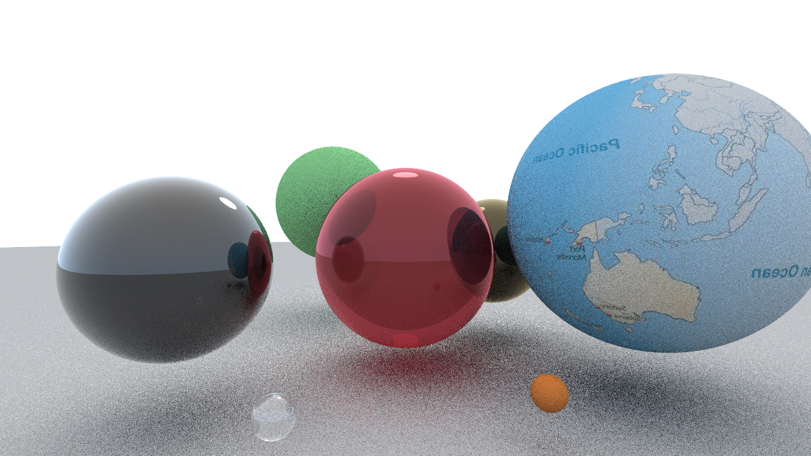

<h1 align="center">Render</h1>

ps:该项目创建于vs2015，请使用支持c++11的编译器编译

## scratchapixel ##
### 进度 ###
- Vector类
- Matrix类

## ray-tracing ##
### 进度 ###
- **Specular reflection** 和 **Refraction**：利用 **Fresnel equation** 
- **Diffuse reflection** ：没有考虑 **Sky light**，仅考虑 **Spot light**，且没有进行 **recursion**

### 缺陷 ###
- 阴影不正常，不应该为全黑：需要完善 **Diffuse reflection**

### 效果 ###
